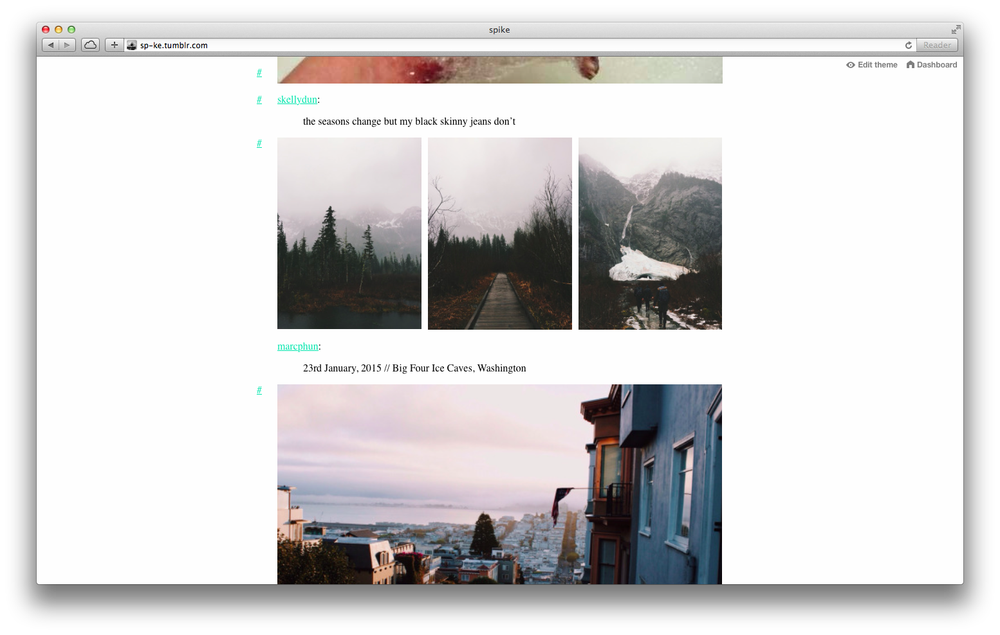

# Chandelier Blank

Chandelier Blank is a [Tumblr theme](https://www.tumblr.com/docs/en/custom_themes) that emphasises content and de-emphasises metadata *(notes, sources, etc.)* structured to allow for easy modification.

> *Uses Tumblr's built-in lightbox for single photo posts; not just photosets*

## Features

* Minimal, content-focused, responsive design
* Post metadata removed *(notes, source, reblogged via ...)*
* Photos in high-res as default
* Photo click through URLs removed, instead clicking opens them in a lightbox
* Infinite scroll
* Accent and background colours easily customisable
* Language independent, using [localized theme strings](https://www.tumblr.com/docs/en/localizing_themes)
* Clean source code, making modification easy
* W3C validated HTML5 and CSS3

## Installation

1. Select all the code in [`blank.html`](https://raw.githubusercontent.com/forlornhedgehog/chandelier/master/blank.html) and copy it
2. Go to [tumblr.com/customize](https://www.tumblr.com/customize) then click `Edit HTML`
3. Delete all the existing code then paste in the new code
4. Press `Update Preview` and then `Save`

## License

This work is licensed under a [Creative Commons Attribution 4.0 International License](https://creativecommons.org/licenses/by/4.0/).

## Credits

* [Normalize.css](https://necolas.github.io/normalize.css/) 5.0.0
* [tumblrAutoPager](https://static.tumblr.com/q0etgkr/EIBmz7s0p/infinitescrolling.js) 0.1.7
* Lightbox from Tumblr's [`lightbox.js`](https://assets.tumblr.com/assets/scripts/tumblelog/lightbox.js) which is included in each page's [`tumblelog.js`](https://assets.tumblr.com/assets/scripts/tumblelog.js), idea via **[@edadams](https://gist.github.com/edadams/6038781)**' gist
